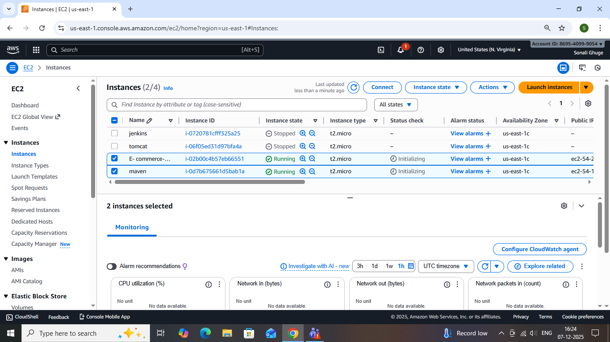
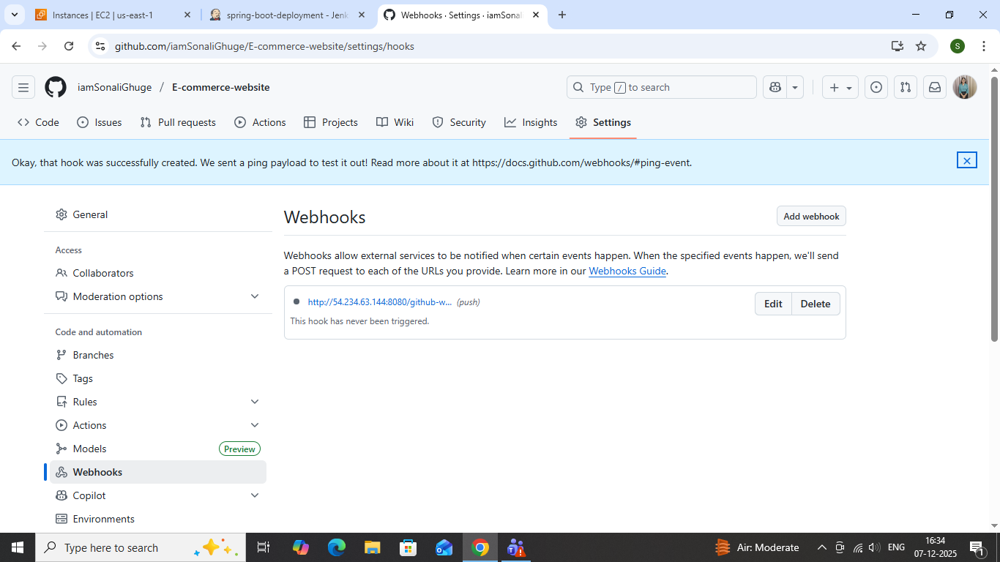
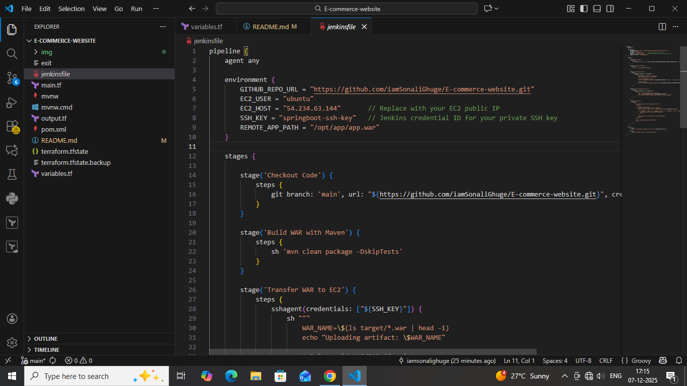

# Deploying an E-Commerce Spring Boot Application on AWS EC2 + RDS

## A Complete CI/CD + Infrastructure-as-Code DevOps Project (Terraform + Jenkins)

This README explains how a production-ready E-Commerce Spring Boot Application was deployed on AWS using a fully automated DevOps workflow. The project integrates Terraform (IaC), Jenkins (CI/CD), GitHub Webhooks, AWS EC2, and AWS RDS to achieve seamless and reliable deployment automation.

## Architecture Overview
A high-level architecture demonstrating the interaction between all components:

Developer → GitHub → Webhook → Jenkins → EC2

Terraform provisions the entire AWS infrastructure

EC2 hosts the Spring Boot application

RDS handles persistent storage

Jenkins automates the build + deploy pipeline

## Step 1: Provision AWS Infrastructure with Terraform
Terraform was used to automatically create all required cloud resources.

### Infrastructure Provisioned
EC2 Ubuntu Server (for application deployment)

RDS (MySQL/PostgreSQL database)

VPC with Subnets & Routing

Security Groups for EC2 ↔ RDS connectivity

IAM Roles & Policies

### Terraform Commands Used
terraform init

terraform plan

terraform apply --auto-approve

## Step 2: Deploy Spring Boot Application on EC2
Since Terraform did not output the EC2 Public IP directly, manual SSH was done using Git Bash.

### Commands Executed on EC2
sudo apt update -y

sudo apt install 

openjdk-17-jdk -y

## Upload Application JAR to EC2
scp -i key.pem target/app.jar ubuntu@EC2_PUBLIC_IP:/home/ubuntu/

## Run the Spring Boot Application
nohup java -jar app.jar &

## Step 3: Configure AWS RDS for the Application
Used Terraform output to get the RDS endpoint

Updated application.properties:

spring.datasource.url=jdbc:mysql://RDS_ENDPOINT:3306/dbname
spring.datasource.username=USERNAME
spring.datasource.password=PASSWORD

Modified Security Groups to allow EC2 → RDS communication

## Step 4: Jenkins CI/CD Pipeline with GitHub Webhooks
A Jenkins pipeline automates the build and deployment process.

## Pipeline Highlights
GitHub webhook triggers Jenkins on every commit

Maven builds the Spring Boot application

Jenkins transfers the JAR to EC2 via SCP

Jenkins executes SSH commands to restart the application

 
## CI/CD Workflow Summary
1.Developer pushes code to GitHub

2.Webhook triggers Jenkins pipeline

3.Jenkins clones repository

.Maven builds the project

5.JAR file is uploaded to EC2

6.Jenkins restarts Spring Boot service on EC2

7.Application becomes live on EC2

8.EC2 communicates with RDS for database operations

 ## Jenkinsfile
 

 ## Final Outcome
A fully automated production‑grade deployment pipeline using:

✔ Terraform (IaC)

✔ Jenkins (CI/CD Automation)

✔ GitHub Webhooks

✔ AWS EC2 (App Hosting)

✔ AWS RDS (Database)

Your Spring Boot E‑Commerce application now runs live on AWS with automated builds and frictionless deployments.

## Conclusion
This project reflects real‑world DevOps experience and demonstrates best practices in automation, cloud provisioning, and CI/CD. Perfect for:

LinkedIn portfolio posts

Medium technical articles

Resume project sections

Professional devops demonstrations

If you want, I can also add badges, improve styling, or format it like a professional GitHub README template.